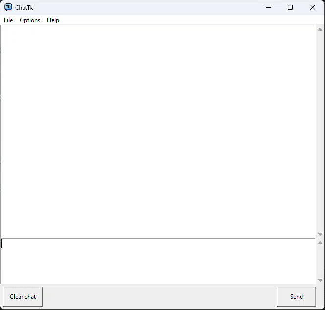
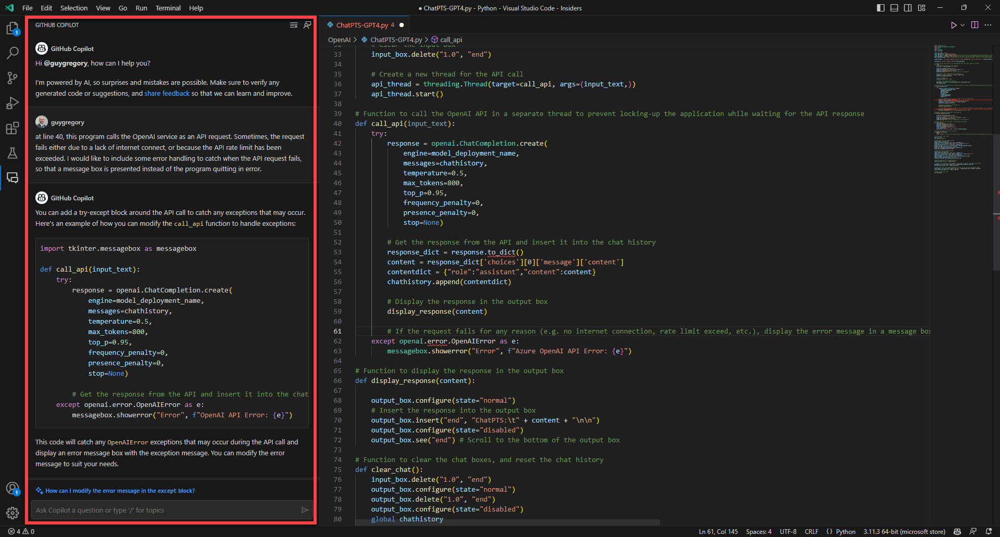
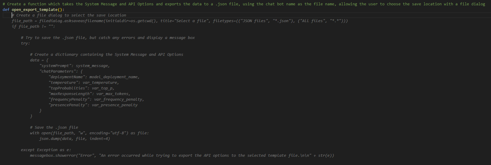
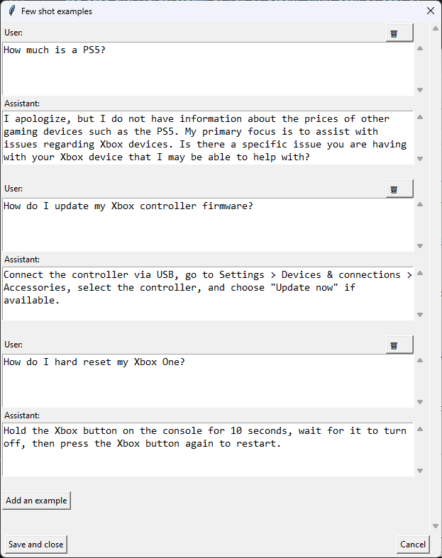

# Chat Toolkit - Azure OpenAI sample GPT-4/GPT-3.5 Python application

The [Azure OpenAI Service](https://azure.microsoft.com/en-in/blog/general-availability-of-azure-openai-service-expands-access-to-large-advanced-ai-models-with-added-enterprise-benefits/) provides businesses and developers with high-performance AI models at production scale with industry-leading uptime. This is the same production service that Microsoft uses to power its own products, including [GitHub Copilot](https://github.com/features/copilot/?culture=en-us&country=us), an AI pair programmer that helps developers write better code, [Power BI](https://news.microsoft.com/source/features/innovation/from-conversation-to-code-microsoft-introduces-its-first-product-features-powered-by-gpt-3/?culture=en-us&country=us), which leverages OpenAI-powered natural language to automatically generate formulae and expressions, and the recently-announced [Microsoft Designer](https://designer.microsoft.com/), which helps creators build stunning content with natural language prompts.

As a Partner Technololgy Strategist (PTS) at Microsoft, I wanted to create a simple app to demonstrate the simplicity of the new Azure OpenAI service to our partners and customers. I'm not an experienced developer, so I began with the sample code from [Chat Playground in Azure OpenAI Studio](https://oai.azure.com/portal/playground) and used both [GitHub Copilot](https://github.com/features/copilot) and the preview of GitHub Copilot Chat (part of [GitHub Copilot X](https://github.com/features/preview/copilot-x?ref=sidebar)) to co-create the rest.

*Here's the sample code from [Chat Playground in Azure OpenAI Studio](https://oai.azure.com/portal/playground)*

*Here's an example of how I used GitHub Copilot Chat to provide some simple error handling (using the [VS Code extension](https://marketplace.visualstudio.com/items?itemName=GitHub.copilot-chat)).*

*Based on the comment and function declaration, GitHub Copilot wrote this whole template export function, which ran first-time.

*The API Options allow the model parameters to be adjusted, and reflects the controls in [Azure OpenAI Studio](https://oai.azure.com/portal)*

*If zero-shot (system prompt-only) doesn't suffice, few-shot examples can be used to guide the model further*

## How to use - Prerequisites

* Before deploying Azure OpenAI, please gain approval for your Azure subscription. [Here's the form](https://aka.ms/oai/access) (currently business customers/managed partners/MSFT internal only)
* Once you've had approval, you'll need to deploy the Azure OpenAI service into your subscription. [Instructions are on the Microsoft Docs page.](https://learn.microsoft.com/en-us/azure/cognitive-services/openai/how-to/create-resource?pivots=web-portal)
* Next, you'll need to [deploy at least one model](https://learn.microsoft.com/en-us/azure/cognitive-services/openai/how-to/create-resource?pivots=web-portal#deploy-a-model), either the standard GPT-3.5 Turbo model, or GPT-4/GPT-4-32k if you have access.
* **GPT-4o** This app will work best with the GPT-4o model, although any model which can be used with version 1.x of the OpenAI Python Library should also work fine (inc. GPT-3.5 Turbo and other versions of GPT-4)
* **Regions** Not all models are available in every Azure region. Check [this page]([https://learn.microsoft.com/en-us/azure/cognitive-services/openai/concepts/models#gpt-4-models](https://learn.microsoft.com/en-us/azure/ai-services/openai/concepts/models#gpt-4-and-gpt-4-turbo-model-availability)) to check region availability.

## How to use - Downloading and running the application
* The app requires that you have Python installed, which can be downloaded [here (python.org)](https://www.python.org/downloads/) or [here (Microsoft Store)](https://www.microsoft.com/store/productId/9NRWMJP3717K)
* The app requires the [OpenAI](https://pypi.org/project/openai/) Python library (pip install openai)
* Download/clone the script onto your local computer
* Add the OPENAI_API_KEY and OPENAI_API_BASE environmental variables on your PC using the details from your own Azure OpenAI instance. [Use the guide here](https://learn.microsoft.com/azure/cognitive-services/openai/chatgpt-quickstart?tabs=command-line&pivots=programming-language-python#environment-variables) to understand how to set environmental variables.  
*For example, on Windows:*  
*setx OPENAI_API_BASE "https://<INSTANCE-NAME>.openai.azure.com/"*  
*setx OPENAI_API_KEY "1234567890abcdef1234567890abcdef"*    
* Edit the model name, unless you named it 'gpt-4'
* When running the .py script, a Tkinter form should appear as per the above screenshot

## Please note

* When building applications using Azure OpenAI, developers must adhere to the [code of conduct and responsible AI principles.](https://learn.microsoft.com/legal/cognitive-services/openai/code-of-conduct?context=%2Fazure%2Fcognitive-services%2Fopenai%2Fcontext%2Fcontext)
* This is not an official Microsoft code sample, and is intended as a conversation starter, not as a production-ready application.

## Feedback

*  Reach me on [Twitter @guygregory](https://twitter.com/guygregory) or [LinkedIn](https://linkedin.com/in/guygregory)
*  Found a bug? Have a suggestion? Please create a [new issue](https://github.com/guygregory/ChatToolkit/issues)!

