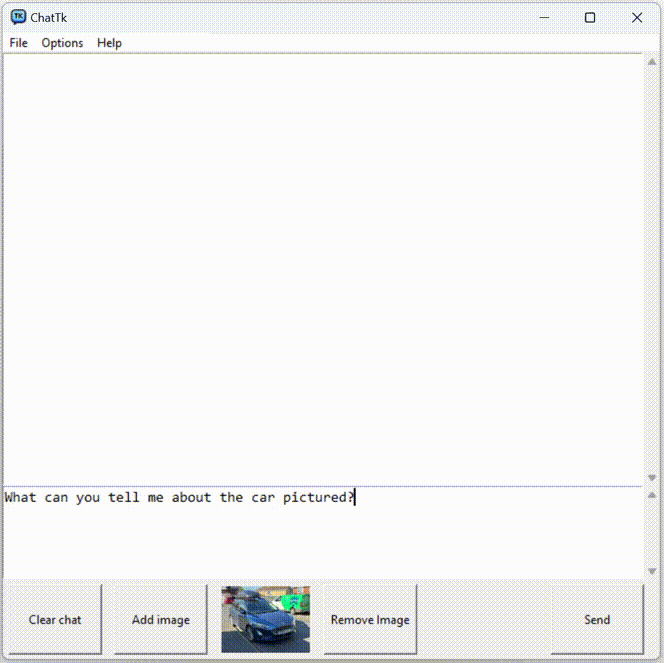
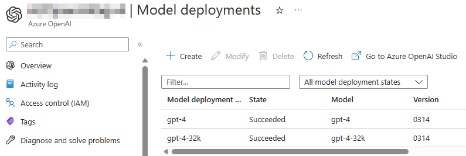

# Chat Toolkit - Azure OpenAI sample GPT-4o application
Update 18/06/24 - Now supports vision with the GPT-4o model

Update 16/06/24 - Now supports version 1.x of the OpenAI Python Library. The old version can be found in the [legacy](/legacy/ChatTk-legacy.py) folder.



As a Partner Technololgy Strategist (PTS) at Microsoft, I wanted to create a simple app to demonstrate the simplicity of the Azure OpenAI service to our partners and customers. This sample was originally written for the 0.x version of the OpenAI Python library and GPT-3.5, but has recently been updated to use the newer 1.x version of the library, with GPT-4o as the preferred model.


*The API Options allow the model parameters to be adjusted, and reflects the controls in [Azure OpenAI Studio](https://oai.azure.com/portal).*


*If zero-shot (system prompt-only) doesn't suffice, few-shot examples can be used to guide the model further*

## How to use - Prerequisites

* Before deploying Azure OpenAI, please gain approval for your Azure subscription. [Here's the form](https://aka.ms/oai/access) (currently business customers/managed partners/MSFT internal only)
* Once you've had approval, you'll need to deploy the Azure OpenAI service into your subscription. [Instructions are on the Microsoft Docs page.](https://learn.microsoft.com/en-us/azure/cognitive-services/openai/how-to/create-resource?pivots=web-portal)
* Next, you'll need to [deploy at least one model](https://learn.microsoft.com/en-us/azure/cognitive-services/openai/how-to/create-resource?pivots=web-portal#deploy-a-model), ideally GPT-4o.
* **GPT-4o** This app will work best with the GPT-4o model, although any model which can be used with version 1.x of the OpenAI Python Library should also work fine (inc. GPT-3.5 Turbo and other versions of GPT-4)
* **Regions** Not all models are available in every Azure region. Check [this page]([https://learn.microsoft.com/en-us/azure/cognitive-services/openai/concepts/models#gpt-4-models](https://learn.microsoft.com/en-us/azure/ai-services/openai/concepts/models#gpt-4-and-gpt-4-turbo-model-availability)) to check region availability.




## How to use - Downloading and running the application
* The app requires that you have Python installed, which can be downloaded [here (python.org)](https://www.python.org/downloads/) or [here (Microsoft Store)](https://www.microsoft.com/store/productId/9NRWMJP3717K)
* Download/clone the repo onto your local computer
* Create a .env file in the working folder, and update with your own API key, Azure OpenAI endpoint details, and model name.

## Install required packages ##
Download the requirements.txt and install the packages (openai, Pillow, python-dotenv)
```
pip install -r requirements.txt
```

## Example .env file ##
```
# .env
AZURE_OPENAI_API_KEY = "xxxxxxxxxxxxxxxxxxxxxxxxxxxxxxxx"
AZURE_OPENAI_API_ENDPOINT = "https://xxxxxxxxxx.openai.azure.com/"
AZURE_OPENAI_API_MODEL = "gpt-4o"
AZURE_OPENAI_API_VERSION = "2024-02-01"
```

## Please note

* When building applications using Azure OpenAI, developers must adhere to the [code of conduct and responsible AI principles.](https://learn.microsoft.com/legal/cognitive-services/openai/code-of-conduct?context=%2Fazure%2Fcognitive-services%2Fopenai%2Fcontext%2Fcontext)
* This is not an official Microsoft code sample, and is intended as a conversation starter, not as a production-ready application.

## Feedback

*  Reach me on [Twitter @guygregory](https://twitter.com/guygregory) or [LinkedIn](https://linkedin.com/in/guygregory)
*  Found a bug? Have a suggestion? Please create a [new issue](https://github.com/guygregory/ChatToolkit/issues)!

