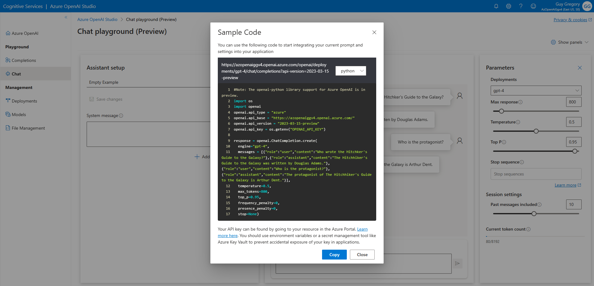

# Azure OpenAI sample GPT-4/GPT-3.5 Python application - "ChatPTS"

The [Azure OpenAI Service](https://azure.microsoft.com/en-in/blog/general-availability-of-azure-openai-service-expands-access-to-large-advanced-ai-models-with-added-enterprise-benefits/) provides businesses and developers with high-performance AI models at production scale with industry-leading uptime. This is the same production service that Microsoft uses to power its own products, including [GitHub Copilot](https://github.com/features/copilot/?culture=en-us&country=us), an AI pair programmer that helps developers write better code, [Power BI](https://news.microsoft.com/source/features/innovation/from-conversation-to-code-microsoft-introduces-its-first-product-features-powered-by-gpt-3/?culture=en-us&country=us), which leverages OpenAI-powered natural language to automatically generate formulae and expressions, and the recently-announced [Microsoft Designer](https://designer.microsoft.com/), which helps creators build stunning content with natural language prompts.

As a Partner Technololgy Strategist (PTS) at Microsoft, I wanted to create a simple app to demonstrate the simplicity of the new Azure OpenAI service to our partners and customers. I'm not an experienced developer, so I utilized the GPT-4 model and the [Chat Playground in Azure OpenAI Studio](https://oai.azure.com/portal/playground) to co-create the code for this application.

<!--

Here were seven efficiencies I gained, thanks to the Azure OpenAI service:

1. I didn't have to write the underlying code for the API call, because it was generated from the [Azure OpenAI Studio](https://oai.azure.com/portal/playground)
2. I didn't have to write the Tkinter UI, because GPT-3 wrote it for me
3. I didn't have to figure out how to resize the text boxes, because GPT-3 showed me how to do it, and provided the updated code
4. GPT-3 helped me to apply word wrapping within the text boxes
5. GPT-3 advised me how to change the font style
6. I didn't have to work out how to extract the 'text' value from the returned JSON, because GPT-3 wrote the code to extract the value for me
7. GPT-3 wrote all the comments (apart from the comments from the sample code)

As a result:

* 44% (16 lines) of code came from the Sample Code in GPT-3 Playground in [Azure OpenAI Studio](https://oai.azure.com/portal/playground)
* 56% (20 lines) of code were generated by GPT-3, based on my natural language prompts
* 0%  (0 lines) of code were written by me - I simply copied and pasted the code snippets together

 -->

## How to use - Prerequisites

* Before deploying Azure OpenAI, please gain approval for your Azure subscription. [Here's the form](https://aka.ms/oai/access) (currently business customers/managed partners/MSFT internal only)
* **GPT-4** (Optional) At time of writing, GPT-4 models are currently in preview. Once you've had Azure OpenAI approved for your subscription, [you can apply for GPT-4 by filling out this form](https://aka.ms/oai/get-gpt4)
* **GPT-4** (Optional) At time of writing, GPT-4 models are only available in East US and South Central US Azure regions. Check [this page](https://learn.microsoft.com/en-us/azure/cognitive-services/openai/concepts/models#gpt-4-models) for new regions added in future.
* Once you've had approval, you'll need to deploy the Azure OpenAI service into your subscription. [Instructions are on the Microsoft Docs page.](https://learn.microsoft.com/en-us/azure/cognitive-services/openai/how-to/create-resource?pivots=web-portal)
* Next, you'll need to [deploy at least one model](https://learn.microsoft.com/en-us/azure/cognitive-services/openai/how-to/create-resource?pivots=web-portal#deploy-a-model), either the standard GPT-3.5 Turbo model, or GPT-4/GPT-4-32k if you have access.

## How to use - Downloading and running the application
* The script requires that you have Python installed, which can be downloaded [here (python.org)](https://www.python.org/downloads/) or [here (Microsoft Store)](https://www.microsoft.com/store/productId/9NRWMJP3717K)
* Required modules: [Tkinter](https://docs.python.org/3/library/tkinter.html), [OpenAI](https://pypi.org/project/openai/) (example: pip install openai), os, threading, and datetime
* Download/clone the script onto your local computer
* Add the OPENAI_API_KEY and OPENAI_API_BASE environmental variables on your PC using the details from your own Azure OpenAI instance. [Use the guide here](https://learn.microsoft.com/azure/cognitive-services/openai/chatgpt-quickstart?tabs=command-line&pivots=programming-language-python#environment-variables) to understand how to set environmental variables. You'll also need to edit the model name, unless you named it 'gpt-4'
* When running the .py script, a Tkinter form should appear as per the above screenshot

## Please note

* When building applications using Azure OpenAI, developers must adhere to the [code of conduct and responsible AI principles.](https://learn.microsoft.com/legal/cognitive-services/openai/code-of-conduct?context=%2Fazure%2Fcognitive-services%2Fopenai%2Fcontext%2Fcontext)
* This is not an official Microsoft code sample, and is intended as a conversation starter, not as a production-ready application.

## Feedback

*  Reach me on [Twitter @guygregory](https://twitter.com/guygregory) or [LinkedIn](https://linkedin.com/in/guygregory)
*  Found a bug? Have a suggestion? Please create a [new issue](https://github.com/guygregory/ChatPTS/issues)!
